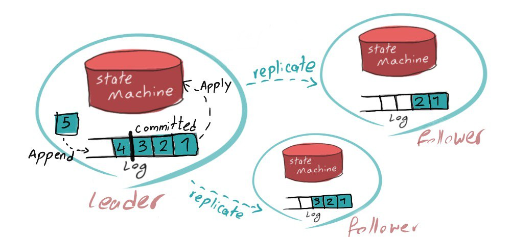
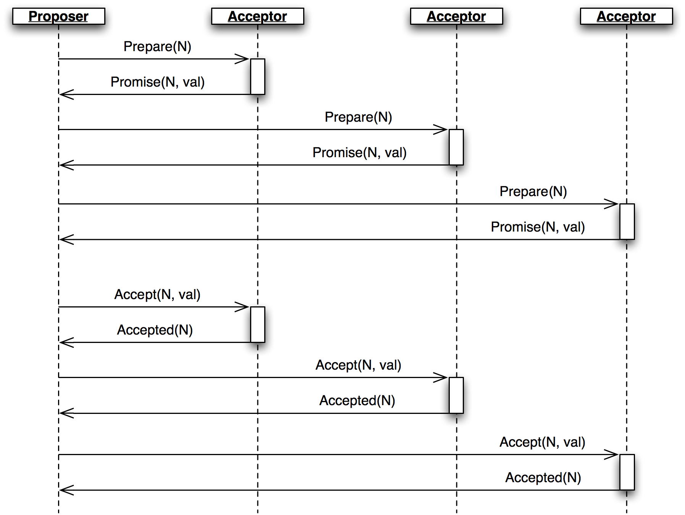
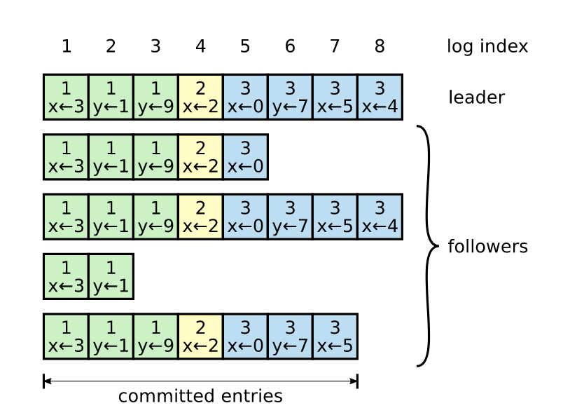
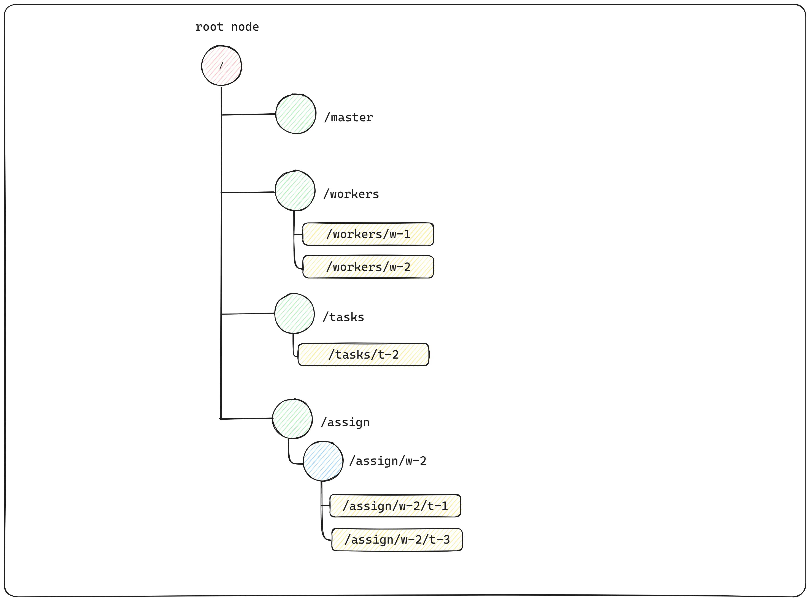
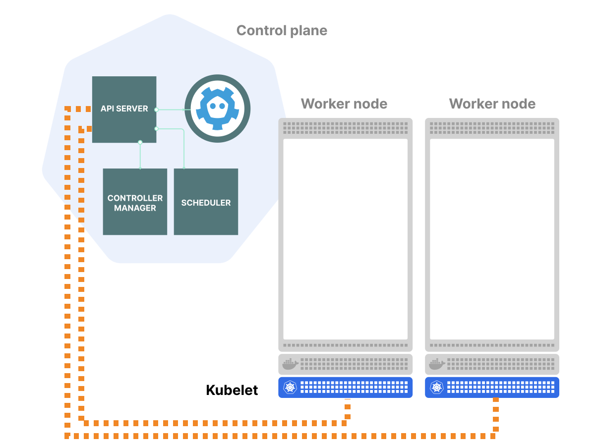

# Консенсус

- [Слайды с лекции](../11-consensus.pdf)
- [Разделы 6 и 7 из курса Клеппманна про консенсус](https://www.cl.cam.ac.uk/teaching/2021/ConcDisSys/dist-sys-notes.pdf)

## Консенсус и Replicated State Machine

Если все запросы в системе обрабатывает один сервер, то внутри такого сервера можно реализовать произвольно сложную логику. Какие примеры нераспределенных систем вы знаете (которые обрабатывают запросы на одном сервере)?

Например, на локальном компьютере доступны следующие операции:
- Упорядочивание операций
- Блокировки (locks)
- Атомарные RMW-операции типа compare-and-swap (CAS)

С помощью этих операций несложно реализовать логику для любого из таких требований:
- Только один клиент должен вести запись в файл
- Только один узел в системе должен играть эту роль
- У каждого пользователя должно быть уникальное имя
- Баланс счёта не должен быть отрицательным
- Не должно быть продано больше товаров, чем есть на складе
- Реплицируемое хранилище должно обеспечивать линеаризуемость
- Транзакция не должна быть зафиксирована в системе частично

---

Что делать в случае отказа единственного сервера? Как запустить такую же систему на 3-х серверах и обеспечить её работоспособность в случае отказа одного из них?

В этом может помочь реализация RSM (Replicated State Machine). Предлагается все операции, которые происходят в нашей системе, записывать в некоторый лог операций, который будет реплицироваться на все узлы. Узел может последовательно прочитать лог и выполнить все операции, тем самым получив актуальное состояние системы.

<p align="center"></p>

С помощью RSM можно реализовать любую распределенную систему, которая будет запущена на нескольких серверах, но вести себя так, будто запущена на одном. Алгоритмы консенсуса часто используют именно для поддержания примитива RSM.

Как правило, реализовывать алгоритм консенсуса самому не требуется. Можно использовать готовые отказоустойчивые реализации, поддерживающие помимо RSM такие базовые абстракции и примитивы, как:
- Key-Value хранилище
- Выбор лидера
- Сервис блокировок
- Координатор транзакций
- Упорядоченная рассылка (total order broadcast)
- Линеаризуемые атомарные операции типа CAS (compare-and-swap)

---

Какие отказы не нарушают работу системы? Какие отказы нарушают работу системы?

Консенсус работает в модели, в которой:
- узлы могут переставать работать на неопределенное время
- сообщения в сети могут быть потеряны или задерживаться на неопределенное время

В такой модели гарантируется строгая согласованность данных (линеаризуемость). Это довольно стандартная модель, которая подходит для большинства распределенных систем. Стоит понимать, что в данной модели мы работаем в доверенном окружении и считаем, что византийских отказов нет.

Далее будут рассмотрены классические алгоритмы и реализации консенсуса.

## Paxos

В 1998 году была опубликована статья Лесли Лэмпорта [The Part-Time Parliament](https://lamport.azurewebsites.net/pubs/lamport-paxos.pdf). Она отличалась от привычных нам публикаций по Computer Science. В статье описывается древнегреческий остров Паксос (Paxos), где существует парламент, которому необходимо принимать некоторые решения. Всё усложняется тем, что члены парламента могут временно убывать с острова, но парламент при этом должен продолжать  функционировать даже в условиях отсутствия некоторых членов.

> Recent archaeological discoveries on the island of Paxos reveal that the parliament functioned 
> despite the peripatetic propensity of its part-time legislators. The legislators maintained consistent
copies of the parliamentary record, despite their frequent forays from the chamber and the 
> forgetfulness of their messengers. The Paxon parliament’s protocol provides a new way of implementing
> the state-machine approach to the design of distributed systems.

Изначально данный материал не хотели принимать к публикации из-за его необычности, однако в конце концов в нем получилось разглядеть аналогию с задачей консенсуса. Позже Лэмпорт опубликует упрощенную версию статьи [Paxos Made Simple](https://lamport.azurewebsites.net/pubs/paxos-simple.pdf).

В базовом своем варианте алгоритм Paxos позволяет нескольким узлам договориться об одном значении. Но в рамках Replicated State Machine этого недостаточно, необходимо поддерживать некоторый append-only список значений. Эту задачу позволяет решать расширенная версия алгоритма &mdash; Multi-Paxos.

Алгоритм предлагает ввести две роли в систему: есть Proposer'ы &mdash; узлы, которые предлагают значение, и Acceptor'ы &mdash; узлы, которые принимают предложения от Proposer'ов. Один узел может одновременно реализовывать две роли: предлагать значения и участвовать в их принятии.

Исполнение алгоритма разделяется на логические раунды. В каждом раунде Proposer'ы обращается к Acceptor'ам и начинают двухэтапный процесс предложения 
нового значения: сначала получают подтверждение от каждого Acceptor'a, и если есть большинство голосов, рассылают сообщение о принятии нового значения.

<p align="center"></p>

*Источник: [aosabook.org](https://aosabook.org/en/500L/clustering-by-consensus.html)*

В рамках данного материала мы не будем рассматривать детали алгоритма, так как без полного погружения довольно сложно понять тонкие моменты, которые в нем возникают. Рекомендуем обратиться к оригинальным статьям и видео на youtube.

Более подробно с историей создания и публикации данного алгоритма можно ознакомиться в [видео](https://www.youtube.com/watch?v=RFkzp7WXAT4).

Paxos использовался в сервисе блокировок [Chubby](https://static.googleusercontent.com/media/research.google.com/en//archive/chubby-osdi06.pdf), распределенном хранилище [Spanner](https://static.googleusercontent.com/media/research.google.com/en//archive/spanner-osdi2012.pdf) и до сих пор используется во многих распределенных хранилищах.

### Теорема FLP

Алгоритм консенсуса в распределенных системах должен обладать тремя свойствами:
- **Safety**: узлы договариваются о значении, которое действительно было предложено одним из узлов.
- **Liveness**: узлы в конечном счёте договариваются о значении, то есть присутствует прогресс.
- **Fault-tolerance**: алгоритм работает, даже если есть отказы узлов и проблемы на уровне сети.

В 1985 году учёные Michael **F**ischer, Nancy **L**ynch и Michael **P**aterson публикуют статью [Impossibility of Distributed Consensus with One Faulty Process](https://groups.csail.mit.edu/tds/papers/Lynch/jacm85.pdf), основной результат которой часто называют теоремой FLP по первым буквам фамилий авторов.

В рамках теоремы FLP показывается, что в асинхронной распределенной системе нельзя гарантировать достижение консенсуса (свойство liveness) в присутствии хотя бы одного отказа узла типа crash-stop. Это утверждение справедливо для Paxos и для всех других детерминированных алгоритмов консенсуса.

Действительно, алгоритм Paxos в условиях отказов в асинхронной системе гарантирует safety, но не liveness. Как правило, система будет делать прогресс и узлы смогут договориться об итоговом значении. Но всё же остается ненулевая вероятность того, что узлы никогда не придут к консенсусу (из-за задержек на уровне сети и отказов узлов). 

Несмотря на результат FLP, на практике вероятностью нарушения liveness можно пренебречь, поскольку реальные системы являются частично синхронными, а алгоритмы консенсуса могут избегать отсутствия прогресса с помощью таймаутов. Кроме того, было показано что консенсус в асинхронной системе можно достичь с помощью [вероятностного алгоритма](https://brooker.co.za/blog/2014/01/12/ben-or.html).

Подробнее узнать о теореме FLP можно в [данном материале](https://dinhtta.github.io/flpcap/).

## Raft

Paxos часто критикуют за сложность в понимании и наличие подводных камней, которые могут быть неочевидны при реализации алгоритма на практике.

В 2014 году была опубликована статья, описывающая алгоритм консенсуса [Raft](https://raft.github.io/raft.pdf). Также доступно более подробное изложение деталей алгоритма в рамках [диссертации](https://github.com/ongardie/dissertation#readme) Diego Ongaro, основного автора Raft.

У авторов Raft получилось компактно и понятно объяснить идею алгоритма: основные шаги алгоритма Raft описаны на одной странице A4 в опубликованной статье. Благодаря данной простоте Raft быстро завоевал внимание разработчиков, появилось множество реализаций, а некоторые распределенные хранилища в итоге перешли от Paxos на Raft. Также Raft часто используется разработчиками в более простых системах в качестве подключаемого решения в виде библиотеки.

На [официальном сайте](https://raft.github.io/) можно ознакомиться с визуализацией выполнения и примерами реализации алгоритма на разных языках программирования. Также есть [интерактивный сайт](http://thesecretlivesofdata.com/raft/), который наглядно показывает как работает Raft в условиях разделения сети.

<p align="center"></p>

Для понимания алгоритма рекомендуем обратиться к оригинальной статье и [видео от HashiCorp](https://www.youtube.com/watch?v=EGRmmxVFOfE).

### KV-хранилище на основе Raft

Примерно в то же время, что и публикация статьи про Raft, появились Docker и Kubernetes, начал своё бурное развитие язык программирования Go. Началась эра cloud-native приложений, которые по умолчанию запускаются в нескольких геораспределенных кластерах.

Поэтому популярные реализации Raft реализованы именно на Go: [hashicorp/raft](https://github.com/hashicorp/raft) и [etcd-io/etcd](https://github.com/etcd-io/etcd).

Мы возьмем готовую реализацию использующую `hashicorp/raft` и gRPC, и реализуем свой KV Storage на ее основе ([пример](https://github.com/Jille/raft-grpc-example)).

Необходимо реализовать простой KV Storage, который будет поддерживать следующие операции:
- `Get(key) -> value`
- `Set(key, value)`
- `CAS(key, old_value, new_value) -> value_before_update`

Реализация находится в директории [kv](./kv).

Запустим наш код и попробуем выполнить несколько запросов. Делать запросы можно с помощью `grpcurl`:

```bash
# Удаляем старые данные и запускаем три узла
docker-compose down -v && docker-compose build && docker-compose up

# Смотрим IP адреса узлов
docker inspect raft1

# Делаем CAS запрос
grpcurl -proto proto/service.proto -d '{"query":"cas,num,10,20"}' -plaintext 172.22.0.3:50051 Example/Query

# Можно зайти в контейнер и посмотреть данные, сохраненные на диске
docker exec -t -i raft1 /bin/bash
```

## Универсальные решения на базе консенсуса (Consensus as a Service)

### ZooKeeper


[Apache Zookeeper](https://zookeeper.apache.org/) это сервис для хранения конфигурации, поддержания списка узлов, организации выборов лидера и других задач, свойственных распределенным системам.

Внутри ZooKeeper с помощью алгоритма [Zab](https://www.researchgate.net/profile/Benjamin-Reed-9/publication/224248727_Zab_High-performance_broadcast_for_primary-backup_systems/links/640eb61b66f8522c389d32e9/Zab-High-performance-broadcast-for-primary-backup-systems.pdf) реализован примитив [Atomic Broadcast](https://zookeeper.apache.org/doc/r3.4.13/zookeeperInternals.html#sc_atomicBroadcast), который эквивалентен задаче консенсуса в распределенных системах.

Модель данных ZooKeeper похожа на древовидную файловую систему. Клиенты могут создавать узлы в дереве, хранить в них некоторую информацию, подписаться на обновления узлов и на изменение списка "детей" узла.

<p align="center"></p>

*Источник: [Kishan Kumar](https://www.0xkishan.com/blogs/decoding-zookeeper)*

Этот простой примитив, например, довольно легко позволяет решить задачу управления группой (membership): каждый активный участник группы создает эфемерный узел-ребенок по заранее выбранному ключу. Чтобы получить список участников, необходимо получить список детей по ключу. Когда участник отключается, ZooKeeper удаляет соответствующий узел из дерева.

На практике ZooKeeper применяется в следующих сценариях:
- Конфигурационный сервис (многим репликам приложения нужно доставлять изменения конфигурации)
- Управление группой
- Выборы лидера
- Блокировки, семафоры, барьеры
- Счетчики, очереди
- Фиксация транзакций

Запустить ZooKeeper кластер можно локально с помощью [docker compose](https://dev.to/jv/zookeeper-cluster-with-docker-compose-jml) (см. директорию [zookeeper](./zookeeper/)).

Подробнее про применение ZooKeeper на практике:

- [ZooKeeper Paper](https://www.usenix.org/legacy/event/atc10/tech/full_papers/Hunt.pdf)
- [ZooKeeper Programmer's Guide](https://zookeeper.apache.org/doc/current/zookeeperProgrammers.html)
- [Модель данных ZooKeeper](https://medium.com/develbyte/zookeeper-namespace-and-operations-4bdbbee5ab37)
- [Блог про ZooKeeper Use Cases](https://blog.acolyer.org/2015/01/27/zookeeper-wait-free-coordination-for-internet-scale-systems/)
- [Сборник официальных рецептов](https://zookeeper.apache.org/doc/current/recipes.html)
- [Реализация некоторых рецептов](https://apache.googlesource.com/zookeeper/+/refs/tags/release-3.8.0-1/zookeeper-recipes/)
- [Apache Curator, highlevel API framework for ZooKeeper](http://curator.apache.org/)
- [kazoo, Python library for ZooKeeper](https://kazoo.readthedocs.io/en/latest/)
- [ClickHouse Data Replication](https://clickhouse.com/docs/en/engines/table-engines/mergetree-family/replication/)
- [Обзорная статья про ZooKeeper](https://habr.com/ru/articles/487058/)

### etcd

Относительно новое распределенное хранилище ключ-значение, которое используется в Kubernetes. Внутри используется алгоритм консенсуса Raft. 

Kubernetes использует etcd для хранения информации о кластере: список активных подов, состояние и описание сущностей, механизм блокировок... Подробнее про использование в Kubernetes можно узнать [здесь](https://learnk8s.io/etcd-kubernetes).

<p align="center"></p>

По предоставляемому интерфейсу и набору решаемых задач etcd схож с ZooKeeper, но считается более производительным решением. Подробное сравнение доступно на 
[странице в документации](https://etcd.io/docs/v3.3/learning/why/).

В исходном коде etcd можно найти реализации различных примитивов:
- [Распределенная блокировка](https://github.com/etcd-io/etcd/blob/main/client/v3/concurrency/mutex.go)
- [Выбор лидера](https://github.com/etcd-io/etcd/blob/main/client/v3/concurrency/election.go)

Для обращения к кластеру etcd из терминала существует утилита [etcdctl](https://github.com/etcd-io/etcd/tree/main/etcdctl#elect-options-election-name-proposal).
В директории [etcd](./etcd/) расположен docker-compose файл, позволяющий развернуть кластер.

```bash
# Заходим в контейнер, в котором запущен etcd и установлен etcdctl
docker exec -t -i etcd_etcd_1 /bin/bash

# Можно подписаться на все обновления
etcdctl watch --prefix ""

# Взять блокировку с именем "mylock"
etcdctl lock mylock

# Другие команды здесь:
# https://github.com/etcd-io/etcd/tree/main/etcdctl#elect-options-election-name-proposal
```

### Фиксация распределенной транзакции

Как устроен алгоритм двухфазного коммита? Как можно реализовать подобный алгоритм с помощью etcd?

Фаза Prepare:
 - Клиент/координатор сообщает узлам, что надо сделать _prepare_ (например, через ключ `/transactions/<transaction_id>/status`)
 - Узлы пишут свои голоса (ready или abort) в отдельные ключи (например, `/transactions/<transaction_id>/participants/<participant_id>/vote`)
 - Координатор собирает голоса узлов, например он может отслеживать изменения с помощью механизма watch.
 
Фаза Commit/Rollback:
 - Если все голоса `ready`, то делается _commit_ (фиксация) транзакции (например, координатор пишет `commit` в `/transactions/<transaction_id>/status`)
 - Если хотя бы один голос `abort`, то транзакция откатывается (например, координатор пишет `rollback` в `/transactions/<transaction_id>/status`)

Обработка отказов:
- Если кто-то не ответил в течение таймаута, координатор записывает за него голос `abort` (важно чтобы запись шла через CAS, чтобы узел не мог потом перезаписать это)
 - Если узел упал, то он вычитывает свое состояние перед падением из локального лога и, если он ответил `ready`, но не успел отправить, то отправляет свой ответ.
 - Если координатор упал, то после перезапуска он просто вычитывает состояние из etcd и, если финальное решение еще не выписано, то выписывает его.
