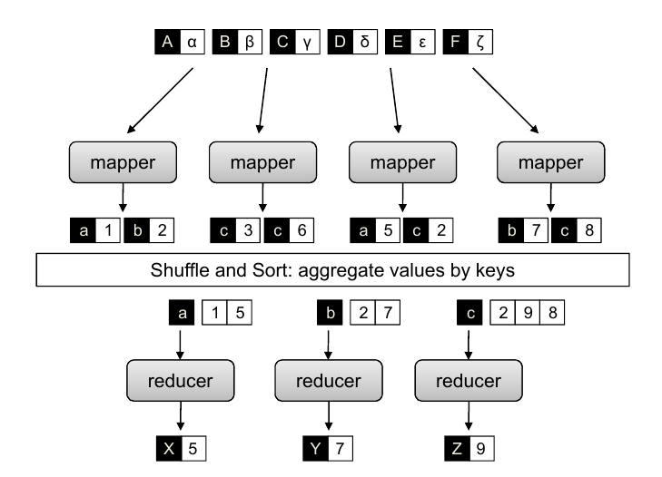
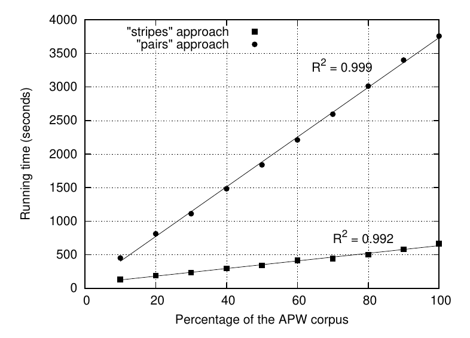

# Параллельная обработка

В рамках данного семинара мы познакомимся с параллельной обработкой запросов и больших данных.

## Хвостовая задержка и обработка запросов

Одна из важных метрик, на которую стоит смотреть при обработке запросов в системе -- время обработки запроса. Обычно смотрят на хвостовую задержку, то есть на высокие квантили (95%, 99%) этой метрики. См. [Why you should measure tail latencies](https://robertovitillo.com/why-you-should-measure-tail-latencies/). Всплески задержки в больших системах могут быть вызваны многими причинами (аппаратные сбои, конфликты за системные ресурсы, работа планировщика ОС или сборщика мусора, потери пакетов и т.д.), устранить которые полностью крайне сложно и дорого.

При параллельной обработке запросов на кластере исходный запрос разбивается на несколько подзапросов, отправляемых на разные машины. Так как время обработки запроса определяется временем обработки самого медленного подзапроса, то с увеличением числа подзапросов влияние хвостовой задержки усиливается, приводя к ухудшению времен обработки запросов. См. статью [The Tail at Scale](https://people.csail.mit.edu/matei/courses/2015/6.S897/readings/tail-at-scale.pdf). Предлагаем ознакомиться с этой проблемой и возможными путями её решения в [лабораторной работе](./tail-latency).

## MapReduce

Эта система появилась в Google в начале нулевых, см. [историю её создания](https://habr.com/ru/articles/432324/) и [статью 2004 года](http://research.google.com/archive/mapreduce-osdi04.pdf). Используемая в Google реализация закрыта, но есть опенсорсная реализация в проекте [Apache Hadoop](https://hadoop.apache.org/).

### HDFS
В MapReduce данные хранятся в распределенной файловой системе. В Google была своя закрытая реализация (GFS, описана в [отдельной статье](https://static.googleusercontent.com/media/research.google.com/ru//archive/gfs-sosp2003.pdf)), в Hadoop используется HDFS.

В HDFS файлы разбиваются на блоки большого размера (128 MB), которые реплицируются и распределяются по разным нодам системы (data node). 
Информация о расположении блоков хранится на специальной ноде, которая называется name node.

### Модель вычислений



*Источник: Jimmy Lin, Chris Dyer. Data-Intensive Text Processing with MapReduce.*

В MapReduce мы работаем с парами (key, value). Одна MapReduce задача (job) обычно состоит из следующих стадий:

- Map. На этой стадии каждая входная пара (k, v) преобразуется в набор выходных пар (k1, v1), ..., (kn, vn). Для этого система запускает несколько Mapper-ов на нодах, где хранятся данные. Каждый Mapper обрабатывает данные ноды по отдельным блокам в оперативной памяти. Эти блоки примерно равны блокам, на которые разбиты файлы в HDFS, но всё-таки немного отличаются. Это происходит из-за того, что блоки в HDFS не согласованы с форматом файлов. Например, если Mapper работает с отдельными строками, то какая-то строка могла оказаться на границе блоков в HDFS и разорваться, а Mapper-у нужна целая строка.
- Shuffle & Sort. На этой стадии пары группируются по ключу и сортируются.
- Reduce. Reducer получает на вход ключ и все значения, сгенерированные Mapper-ами для этого ключа. Выход Reducer'a -- набор пар (k1, v1), ..., (kn, vn). После стадии Shuffe & Sort гарантируется, что каждый ключ попадает только на один Reducer. Конкретный Reducer выбирается по хешу ключа.

Понять смысл Map и Reduce проще всего по аналогии с одноименными функциями в языках программирования:

```python
>>> from functools import reduce
>>> list(map(lambda s: [(w, 1) for w in s.split()], ['a a b a', 'b c b a']))
[[('a', 1), ('a', 1), ('b', 1), ('a', 1)], [('b', 1), ('c', 1), ('b', 1), ('a', 1)]]
>>> reduce(lambda x, y: (x[0], x[1] + y[1]), [('a', 1), ('a', 1), ('a', 1), ('a', 1)])
('a', 4)
```

### Стратегии Pairs и Stripes

**Задача.** По коллекции документов найти для каждой пары слов число вхождений в одно предложение.

Стратегия Pairs
```python
def map(doc_id, document):
    for w in document:
        for u in neighbors(w):
            yield ((w, u), 1)

def reduce(pair, counts):
    yield (pair, sum(counts))
```

Стратегия Stripes
```python
def map(doc_id, document):
    for w in document:
        counts = defaultdict(int)
        for u in neighbors(w):
            counts[u] += 1
        yield (w, counts)

def reduce(word, stripes):
    counts = defaultdict(int)
    for stripe in stripes:
        for (k, v) in stripe.items():
            counts[k] += v
    yield (word, counts)
```

Кто быстрее?



*Источник: Jimmy Lin, Chris Dyer. Data-Intensive Text Processing with MapReduce.*

### Joins
**Задача.** Есть 2 датасета: [(k, S)], [(k, T)]. Надо объединить датасеты по ключу k.

#### Reduce-side Join
Mapper отображает ключи первого датасета в (k, 0), второго -- в (k, 1). Reducer объединяет значения с одним ключом. 
В этом подходе нужен кастомный Partitioner, который будет отображать пары на Reducer-ы не по всему ключу (k, id), а только по k. Заметим также, что если значений с одинаковым ключом много, Reducer должен держать все значения из первого датасета с ключом k в памяти, что может стать проблемой для больших датасетов.

#### Memory-backed Join
Пусть один из датасетов целиком умещается в память. Тогда можно сделать join внутри Mapper-a, загрузив меньший датасет в память каждой ноды. Если же датасет целиком в память не влезает, можно разбить его по ключу на n частей, каждая из которых в память влезает, и запустить несколько MapReduce задач. Заметим, что при использовании данного подхода для некоторых типов join-ов нужен постпроцессинг.

#### Map-side Merge Join
Join внутри Mapper-a можно делать и в тех случаях, когда оба датасета слишком велики для оперативной памяти, при условии, что выполняются некоторые предположения о структуре входных данных.
Если оба датасета отсортированы и одинаково разбиты по ключу, можно реализовать слияние внутри Mapper-а, читая оба датасета инкрементально. Это довольно сильное требование, но его можно обеспечить, если датасеты -- выходные данные других MapReduce задач.

## Полезные материалы

- [Материалы семинара 2020 года](https://github.com/distsys-course/materials/tree/2020/seminars/09-map-reduce)
- [Tail Latency Might Matter More Than You Think](https://brooker.co.za/blog/2021/04/19/latency.html)
- [Data-Intensive Text Processing with MapReduce](https://lintool.github.io/MapReduceAlgorithms/)

