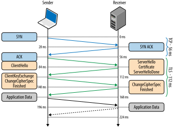
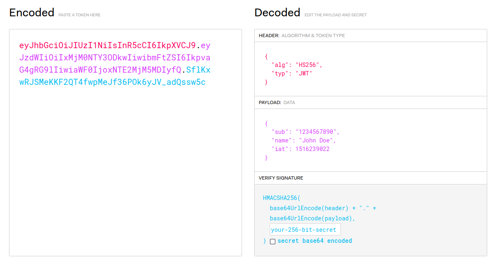

# Безопасность

## Асимметричная криптография

До 70-х годов прошлого века все криптографические алгоритмы были симметричными. Симметричная криптография опирается на то, что у сторон есть какой-то общий секретный ключ, при этом проблема получения этого ключа оставлена за кадром. До эпохи компьютеров эта проблема решалась, например, личной встречей. Но для использования криптографии в масштабах Интернета такое решение уже не подойдёт. Так появилась асимметричная криптография, или криптография с открытым ключом. Вместо одного общего ключа у каждой стороны есть два ключа: открытый и закрытый. Открытый ключ виден всем желающим, а закрытый не виден никому.

Рассмотрим две классические криптосистемы с открытым ключом: RSA и протокол Диффи-Хеллмана. На всякий случай уточним, что изложенные здесь алгоритмы упрощены по сравнению с реально используемыми системами, и в таком виде их лучше не реализовывать. Впрочем, реализовывать криптографию самостоятельно это в принципе очень плохая идея.

### RSA

Выберем большое натуральное число $n$ (например, длиной 2048 бит), такое что оно является произведением двух разных простых чисел: $n = pq$. Далее все действия будут происходить в мультипликативной группе по модулю $n$. Также выберем два числа $e$ и $d$ такие, что $ed \mod \varphi(n) = 1$, где $\varphi(n)$ - функция Эйлера. В качестве открытого ключа мы будем использовать пару $(n, e)$, а в качестве закрытого -- $(n, d)$. 

Теперь если Боб отправляет Алисе сообщение, то он шифрует его на открытом ключе Алисы с помощью преобразования $x \to x^e \mod n$ (здесь сообщение -- это число из мультипликативной группы по модулю $n$). Алиса расшифровывает исходное сообщение, возводя полученное сообщение в степень $d$. Поскольку $ed \mod \varphi(n) = 1$, из теоремы Эйлера следует, что $x^{ed} \mod n = x$, и расшифровка корректна.

Если наоборот, Алиса хочет отправить сообщение Бобу, то шифровать его она будет на открытом ключе Боба, а не на своём. Но если она хочет подписать своё сообщение, чтобы подтвердить, что его отправила именно она, то она будет использовать свой закрытый ключ и возведёт хеш сообщения в степень $d$. Тогда для проверки подписи достаточно возвести подпись в степень $e$, и проверить, что в результате получен верный хеш.

Почему система стойкая? Если злоумышленник получил зашифрованное сообщение, для расшифровки ему надо либо найти $e$-й корень числа по модулю $n$, либо найти закрытый ключ, найдя обратный элемент к $e$ по модулю $\varphi(n)$, для чего нужно узнать $\varphi(n)$. Предполагается, что как для поиска корня, так и для поиска $\varphi(n)$ нет способа проще, чем разложить число $n$ на простые множители. Для разложения большого числа на множители эффективные алгоритмы пока не известны (если не принимать во внимание квантовые алгоритмы, но квантовый компьютер ещё надо построить), поэтому считается, что система стойкая.

Сгенерировать RSA ключи можно с помощью openssl:
```
$ openssl genrsa -out key.pem 2048
```
```
$ openssl rsa -in key.pem -pubout -out public.pub
```
### Diffie-Hellman

RSA и другие подобные криптосистемы работают на практике, но симметричная криптография всё-таки заметно быстрее. Поэтому асимметричная криптография часто используется только для безопасного создания общего секретного ключа, после чего стороны переходят на симметричные алгоритмы. Протокол Диффи-Хеллмана был исторически первым протоколом для создания общего ключа, и он до сих пор используется.

В начале стороны выбирают случайное большое простое число $p$ и ненулевое число $g < p$. После этого Алиса выбирает случайный ненулевой остаток $a$ по модулю $p$, а Боб аналогичным образом выбирает свой остаток $b$. Стороны обмениваются числами $g^a \mod p$ и $g^b \mod p$, после чего каждая сторона получает общий секрет $g^{ab} \mod p$. Из этого секрета стороны получают один или несколько ключей с помощью специальной функции (Key Derivation Function, KDF).

Почему эта система стойкая? Злоумышленник знает $p$, $g$, $g^a \mod p$, $g^b \mod p$, и ему надо получить из этой информации $g^{ab} \mod p$. Предполагается, что нет способа проще, чем найти $a$, вычислив дискретный логарифм числа $g^a \mod p$ по основанию $g$, а потом возвести $g^b \mod p$ в степень $a$. Задача вычисления дискретного логарифма считается сложной, и мы не умеем решать её эффективно для больших $p$ (впрочем, и для этой задачи есть эффективные квантовые алгоритмы).

В том виде, в котором этот протокол здесь изложен, он уязвим к атаке man-in-the-middle: злоумышленник может перехватывать сообщения Алисы и Боба и отправлять им свои, в результате чего они выработают общий секрет не друг с другом, а со злоумышленником. Проблему установления личности собеседника мы рассмотрим в разделе про TLS.

Сгенерировать параметры для этого протокола также можно с помощью openssl:
```
$ openssl dhparam 2048
```

Если вы запустили в консоли эту команду и команды из предыдущего пункта, то вы вероятно заметили, что эта команда работает существенно медленнее. Дело в том, что для стойкости этой системы простое число $p$ должно удовлетворять некоторым дополнительным свойствам, например, число $\frac{p - 1}{2}$ должно быть простым, чтобы в мультипликативной группе не было маленьких подгрупп. Поиск такого простого числа осуществляется не очень быстро.

## TLS

Протокол TLS служит для установления защищенного соединения поверх TCP. Для UDP есть [аналогичный протокол](https://datatracker.ietf.org/doc/html/rfc6347), но мы его рассматривать не будем. Защищенное соединение предоставляет следующие гарантии:
1. Конфиденциальность. Передаваемые данные шифруются, и сторонний наблюдатель видит только последовательсть байт, похожую на случайную.
2. Целостность. Передаваемые данные подписываются, что позволяет распознать сторонние модификации и поддельные пакеты.
3. Аутентификация. При соединении с сервером он предъявляет сертификат, содержащий открытый ключ и подпись удостоверяющего центра. Это позволяет защититься от атак man-in-the-middle.

### TLS Handshake



*Источник: https://hpbn.co/transport-layer-security-tls/*

При установке защищенного соединения происходит рукопожатие, в ходе которого стороны договариваются о выборе алгоритмов и получают общий секрет. Раньше это рукопожатие занимало 2 round-trip'а (см. картинку), но в [TLS 1.3](https://datatracker.ietf.org/doc/html/rfc8446) рукопожатие соптимизировали до одного round-trip'a. Также появилась возможность возобновлять прерванные соединения за 0 round-trip'ов.

### Сертификаты

Также в ходе рукопожатия сервер предъявляет свой сертификат. Сертификат содержит открытый ключ сервера, подпись удостоверяющего центра, срок действия сертификата, и другую информацию. Удостоверяющий центр в свою очередь может иметь сертификат, подписаный другим центром, и так далее до корневого удостоверяющего центра, который считается достаточно известным и авторитетным, чтобы не нуждаться в чьей-либо подписи. Ключи корневых центров включаются в браузеры и ОС.

Клиент получает цепочку сертификатов, оканчивающуюся подписью корневого центра, и проверяет подписи всей цепочки. Если цепочка валидна, то клиент может быть уверен, что открытый ключ действительно принадлежит тому хосту, к которому он хотел подключиться. 

Изучить содержимое сертификата можно с помощью openssl:
```
$ openssl s_client -connect www.google.com:443 | sed -ne '/-BEGIN CERTIFICATE-/,/-END CERTIFICATE-/p' | openssl x509 -text -noout
```

Сертификат может быть отозван до окончания срока действия, например, если закрытый ключ скомпрометирован. Узнать о том, что сертификат отозван, можно сверившись со списками отозванных сертификатов (CRL), которые публикуют удостоверяющие центры. Также есть протокол проверки статуса сертификата OCSP, созданный чтобы не скачивать весь список ради одного сертификата.

## JWT

До этого мы рассматривали безопасность на уровне сети. Однако на уровне приложения тоже возникают связанные с безопасностью задачи. Две часто возникающие задачи -- аутентификация и авторизация. Аутентификация -- это процедура проверки личности пользователя. Авторизация -- процедура проверки его прав на выполнение определенных действий.

Для аутентификации и авторизации на уровне приложения можно использовать _токены_. Клиент отправляет вместе с запросом выданный ему ранее токен, который подтверждает личность клиента и возможно содержит дополнительную информацию его правах. Распространённый формат токенов -- [JSON Web Token (JWT)](https://jwt.io/). Такой токен состоит из заголовка, тела и подписи (см. картинку). Заголовок и тело -- обычные JSON-словари. Тело токена содержит необходимую приложению информацию о личности и правах владельца токена. Чтобы пользователь не мог сам отредактировать свой токен и прописать себе недостающие права, каждый токен подписывается приложением. Для передачи токена внутри URL его части (заголовок, тело и подпись) кодируются в Base64 и разделяются точкой.



Есть [много библиотек](https://jwt.io/libraries) для работы с JWT на разных языках программирования. Пример работы с JWT на Python можно посмотреть [здесь](./jwt).

## Полезные ссылки

- [RSA cryptosystem](https://en.wikipedia.org/wiki/RSA_(cryptosystem))
- [Diffie–Hellman key exchange](https://en.wikipedia.org/wiki/Diffie%E2%80%93Hellman_key_exchange)
- [Transport Layer Security (TLS)](https://hpbn.co/transport-layer-security-tls/)
- [What is token-based authentication?](https://www.cloudflare.com/learning/access-management/token-based-authentication/)
- [JSON Web Token](https://jwt.io/)
- [What's OAuth2 Anyway?](https://www.romaglushko.com/blog/whats-aouth2/)
