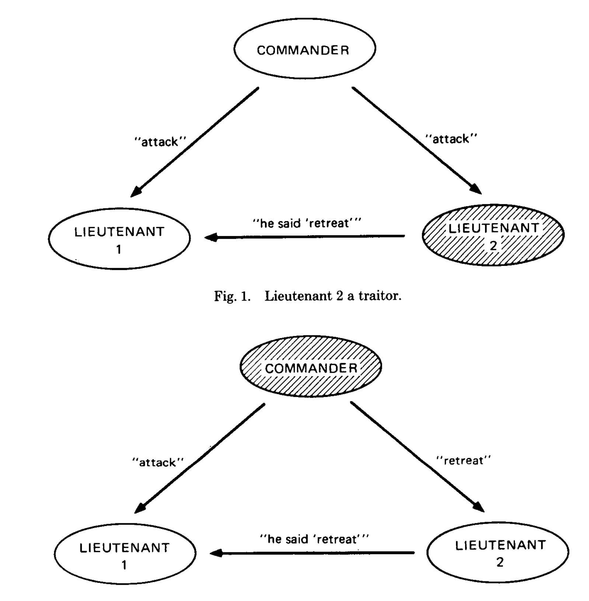
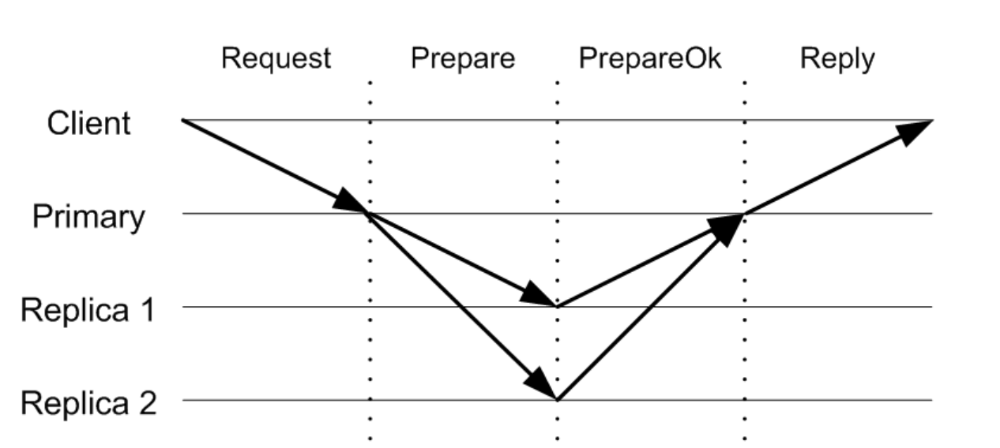
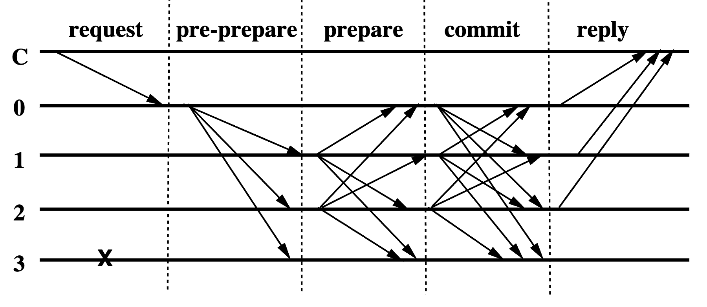
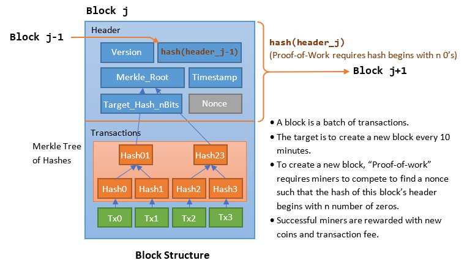
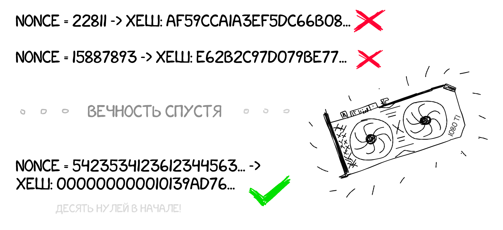
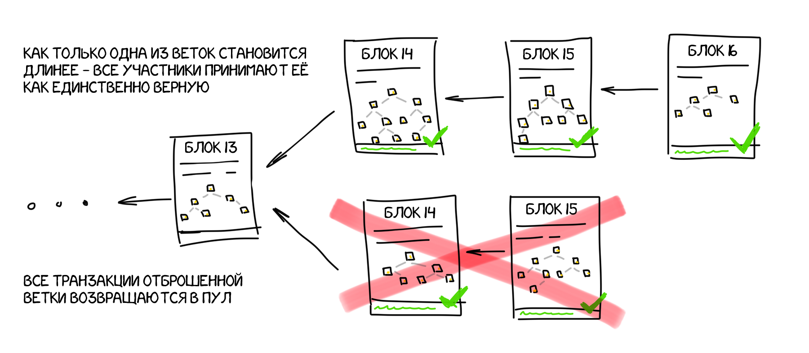
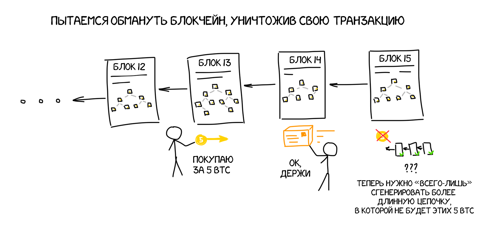
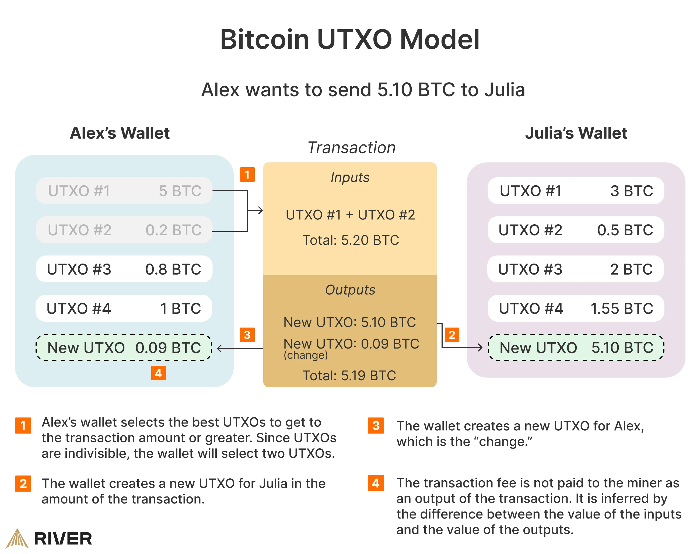
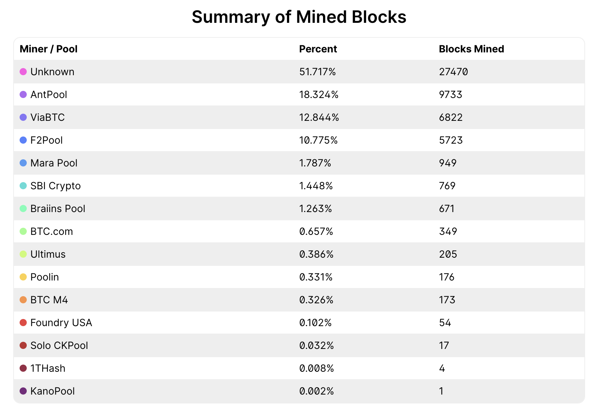

# Борьба с византийскими отказами

## Византийские отказы

Ранее в курсе, когда мы говорили об отказах узлов, то как правило мы имели ввиду модель отказа типа остановки (crash). Узел может быть временно остановлен, но когда он работает, то точно следует заданному алгоритму.

Византийские отказы - это более общая модель отказов, в которой узел может реализовывать произвольную логику поведения, не заложенную в алгоритм. Например, отправлять некорректные сообщения другим узлам и пропускать ответы. Это поведение может быть вызвано как случайными сбоями, так и намеренной атакой злоумышленников. В системе может быть несколько таких византийских узлов, которые могут действовать сообща. 

Классической иллюстрацией такого поведения является задача византийский генералов, описанная Лесли Лэмпортом и коллегами в статье [The Byzantine Generals Problem](https://lamport.azurewebsites.net/pubs/byz.pdf), откуда происходит и название этих отказов.

### Задача византийских генералов

Есть $N$ генералов, командующих своими армиями. Генералы могут обмениваться сообщениями друг с другом, и для успешной операции им необходимо договориться о едином решении: напасть на крепость или отступить. Известно, что $f$ генералов могут оказаться предателями, которые захотят помешать лояльным генералам прийти к согласию касательно плана их действий.

Наша цель &mdash; реализовать алгоритм общения между генералами, позволяющий всем лояльным генералам прийти к одному и тому же решению.


*If all generals attack in coordination, the battle is won (left). If two generals falsely declare 
that they intend to attack, but instead retreat, the battle is lost (right) (c) 
[wikipedia](https://en.wikipedia.org/wiki/Byzantine_fault)*

Эта задача очень похожа на задачу консенсуса. Ранее рассмотренные алгоритмы консенсуса Raft и Paxos гарантируют safety и liveness (на практике) в условиях $N > 2f$, где $f$ - число отказавших узлов. Однако они не устойчивы к византийским отказами. Например, если бы лидер в Raft стал византийским, то он мог бы успешно отправлять heartbeat-ы подчиненным (тем самым избегая запуска новых выборов), но при этом игнорировать запросы клиентов, что нарушит свойство liveness (будет отсутствовать прогресс в обработке запросов).

В статье доказано, что данная задача не имеет решения при $N < 3f + 1$. То есть генералы-предатели всегда смогут своими сообщениями запутать лояльных генералов, чтобы те не пришли к консенсусу. 

Это можно показать на примере системы из трёх узлов с одним византийским ($N=3, f=1$). Узел-предатель может разослать двум другим узлам разные команды. Когда другие узлы обменяются между собой полученными командами, они увидят, что команды их соседей противоречат друг другу. В таком состоянии узлы не смогут понять, какому узлу можно доверять.



*Источник: The Byzantine Generals Problem (Leslie Lamport, Robert Shostak, Marshall Pease)*

### Practical Byzantine Fault Tolerance

Алгоритм [Viewstamped Replication](http://www.pmg.lcs.mit.edu/papers/vr-revisited.pdf) решает задачу консенсуса в условиях crash-отказов. Идея заключается в выделении явного лидера (primary-реплики) и бэкап-реплик.

Клиент отправляет запрос лидеру, лидер рассылает запрос *Prepare* и дожидается успешных ответов *PrepareOk* от большинства реплик, после чего отвечает клиенту. Чтобы обеспечить liveness в условиях отказов лидера, работа алгоритма разделена на эпохи (view). В рамках каждой эпохи выбирается новый лидер. Новая эпоха начинается, когда реплики подозревают, что старый лидер отказал.



*Источник: Viewstamped Replication Revisited (Barbara Liskov, James Cowling)*

Позднее в статье [Practical Byzantine Fault Tolerance](http://www.pmg.lcs.mit.edu/papers/osdi99.pdf) был описан алгоритм PBFT, являющийся расширением Viewstamped Replication на случай византийских отказов и позволяющий достигать консенсус при $N = 3f + 1$. 



*Источник: Practical Byzantine Fault Tolerance (Miguel Castro, Barbara Liskov)*

В рамках PBFT добавляется дополнительная стадия. При этом реплики теперь обмениваются сообщениями друг с другом. Стадии *Prepare* и *Commit* считаются успешно завершенными репликой только тогда, когда она получает идентичное сообщение от кворума из $2f + 1$ реплик (включая себя), совпадающее с результатом предыдущей стадии. Это необходимо для того, чтобы гарантировать согласие между корректными репликами относительно порядка обработанных запросов. Среди $2f + 1$ реплик есть хотя бы $f + 1$ корректная реплика. Так как всего корректных реплик $2f + 1$, то любые два кворума содержат хотя бы одну общую корректную реплику. Поскольку каждая реплика принимает решение один раз, то отсюда следует его единственность.

Вместо одного ответа от лидера, клиент теперь ожидает получения $f + 1$ идентичных ответов от разных реплик, чтобы убедиться в корректности обработки своего запроса.

Критически важным для работы алгоритма в условиях византийских отказов является наличие цифровых подписей. Вместе с каждым сообщением реплика передаёт подпись данного сообщения. Подпись генерируется с помощью закрытого ключа, известного только самой реплике. Другие же реплики могут проверить подпись с помощью открытого ключа реплики, тем самым убедившись, что сообщение было действительно отправлено данной репликой. Эту информацию можно сообщить другим репликам.

Если реплики обнаруживают, что текущий лидер ведет себя некорректно или препятствует прогрессу, то инициируется процедура смены лидера. Новым лидером становится следующая по очереди реплика: *new_leader = epoch % num_replicas*.

Подробнее со стадиями работы алгоритма можно ознакомиться в главе 4 [статьи](http://www.pmg.lcs.mit.edu/papers/osdi99.pdf).

### Основные выводы

- В условиях наличия византийских отказов $f$ узлов консенсус не достижим при числе узлов $N < 3f + 1$.
- Алгоритм PBFT решает задачу византийского консенсуса при $N >= 3f + 1$, тем самым являясь оптимальным по требуемому числу узлов.

## Блокчейн

На практике византийские отказы свойственны децентрализованным системам, где нет доверия к другим пользователям. Злоумышленники могут нарочно отправлять некорректные сообщения / блокировать отправку сообщений от 
корректных пользователей, чтобы дестабилизировать работу системы. 

Хорошей демонстрацией децентрализованных систем являются блокчейн-системы. Рассмотрим основные идеи самых популярных из них.

### Bitcoin

В 2008 году некий Satoshi Nakamoto опубликовал статью 
[Bitcoin: A Peer-to-Peer Electronic Cash System](https://www.ussc.gov/sites/default/files/pdf/training/annual-national-training-seminar/2018/Emerging_Tech_Bitcoin_Crypto.pdf), в которой изложена идея децентрализованной peer-to-peer системы, которую можно использовать для перевода электронных денег без отсутствия контроля со стороны регулятора.

Отсутствие регулятора (или единого центра) в идеале позволяет избавиться от блокировки счетов и бесконечного печатания денег по прихоти какого-то конкретного лица.

#### Ledger book

Говоря про финансовые инструменты и банки мы привыкли оперировать таким понятием как баланс. Если Алиса переводит $100 Бобу, необходимо увеличить баланс Боба на $100 и уменьшить баланс Алисы на $100. Можно сказать, что банки поддерживают некоторый ассоциативный массив с балансами их пользователей.

Криптовалюты и блокчейн предлагают взглянуть на эту проблему иначе. Давайте каждый узел будет хранить весь список (журнал) транзакций, произошедших в системе. Эта информация будет реплицироваться на все узлы и храниться на диске. Чтобы узнать текущий баланс пользователя, необходимо пройтись по всему
журналу транзакций и просуммировать их.

```
1. $100 Alice -> Bob
2. $50 Bob -> Larry
3. $50 Bob -> Alice
4. $50 Bob -> Alice (DECLINED! Insufficient balance)
...

->

Alice: $50
Bob: $0
Larry: $50
```

#### Транзакции

В Bitcoin переводы возможны между двумя кошельками. Абсолютно любой человек может получить свой собственный Bitcoin кошелек, сгенерировав закрытый (приватный) и открытый (публичный) ключи. Адрес кошелька вычисляется из публичного ключа с помощью односторонних криптографических хеш-функций. Пример адреса Bitcoin кошелька: `1A1zP1eP5QGefi2DMPTfTL5SLmv7DivfNa`.

В протоколе Bitcoin поддержана возможность транзакций: владелец кошелька может перевести некоторую сумму биткойнов со своего адреса на некоторый другой кошелек, зная его адрес. 

При создании транзакции в неё включается публичный ключ владельца кошелька и цифровая подпись транзакции, созданная с помощью соответствующего приватного ключа. Таким образом, любой участник системы может проверить, что транзакцию действительно создал владелец кошелька.

Чтобы выполнить транзакцию, необходимо отправить её в систему. Для этого по специальному протоколу можно связаться с каким-то узлом, про который мы точно знаем, что он подключен к системе. После этого данный узел с помощью gossip-протокола распространит информацию по всей системе. И любой пользователь сможет увидеть нашу транзакцию.

Даже если мы подключимся к узлу, который хочет саботировать систему, он не сможет украсть наши деньги, так как приватный ключ известен только нам, а без него не получится создать подпись для транзакции.

Чтобы пользоваться Bitcoin, вам необязательно становиться полноценным участником системы, постоянно держа свой компьютер включенным. Вы можете общаться по специальному протоколу с серверами, запущенными
другими людьми. Нахождение узла для подключения обычно реализуется с помощью 
[DNS](https://developer.bitcoin.org/devguide/p2p_network.html).

#### Блоки

Далее встает вопрос упорядочивания транзакций. Чтобы уметь валидировать транзакции, не допускать двойных трат и выхода в отрицательный баланс, мы должны знать точный timestamp каждой транзакции. Но верить timestamp'ам в распределенной системе с византийскими отказами - не лучшая идея. Поэтому Bitcoin предлагает поделить временное пространство на блоки по ~10 минут. 

Когда происходит генерация транзакции, она попадает в ближайший блок из транзакций. Таким образом, номер блока позволяет выделить некоторый логический timestamp в нашей системе. Теперь мы можем упорядочить транзакции по блокам. 

Если вы хотите оплатить продукты в магазине, вы совершаете транзакцию, дожидаетесь формирования очередного блока, после чего продавец получает информацию о новом блоке и видит, что там есть ваша транзакция.

При этом каждый блок ссылается на предыдущий блок (содержит его хеш), что позволяет выстроить ту самую цепочку из блоков (block chain).


При генерации очередного блока, информация об этом блоке распространяется по всем участникам системы. Узлы системы принимают входящие блоки, валидируют их (сверяют баланс), и записывают к себе на диск. Если злоумышленник попытается распространить блок с некорректной транзакцией (некорректная подпись, отрицательный баланс), данный блок просто не будет принят другими участниками,  так как это вредит системе и обесценит криптовалюту.

Отменить транзакцию, попавшую в блок, не получится.

#### Майнинг блоков

Итак, кто-то должен генерировать новый блок каждые 10 минут. По идее в системе должен быть некоторый лидер, который бы координировал этот процесс и следил за порядком блоков? Но как организовать выборы лидера в системе, где никто не может доверять друг другу?

В Bitcoin нет явно выделенного лидера. Консенсус относительно состава и порядка блоков в системе достигается с помощью подхода, названного *Proof of Work*. Любой участник сети может предложить новый блок и включить туда те транзакции, которые считает нужным. Однако чтобы другие участники системы приняли этот блок, необходимо правильно решить вычислительно сложную задачу. 

Процесс генерации нового блока, сопряженный с решением такой задачи, называется *майнингом*. А узел, занимающийся генерацией новых блоков, называется *майнером*.

Структура [блока](https://en.bitcoin.it/wiki/Block) имеет следующий вид:



*Источник: https://www3.ntu.edu.sg/home/ehchua/programming/blockchain/bitcoin.html*

Заголовок блока состоит из 
- ссылки на предыдущий блок (хеша), чтобы не потерять историю блоков
- хеша [дерева Меркла](https://en.wikipedia.org/wiki/Merkle_tree) из транзакций, которые включены в этот блок
- некоторого значения `target`
- некоторого целочисленного значения `nonce`

Чтобы блок был принят, майнеру необходимо подобрать такой `nonce`, чтобы [значение хеша от заголовка блока](https://en.bitcoin.it/wiki/Block_hashing_algorithm) было меньше значения `target`. На практике это значит, что майнер должен перебирать `nonce` пока полученный хеш не будет иметь несколько нулей в начале.

Стоит учесть, что хеш считается именно от хеша блока, который в себе содержит хеш от списка транзакций, которые были включены в данный блок. Это позволяет ускорить процедуру подсчета хеша, но при этом на момент перебора `nonce` майнер 
уже должен определиться, какие транзакции будут включены в блок.

Причем `target` не может быть произвольным. Это [некоторая константа](https://en.bitcoin.it/wiki/Target), о значении которой договорились все участники системы. Значение выбрано так, чтобы подбор `nonce` был действительно долгой процедурой, которая в среднем занимала бы порядка 10 минут.

Таким образом, работа системы и сама ценность биткойна обеспечивается за счёт большого объема вообще говоря бесполезных вычислений, затрат на майнинговое оборудование и электроэнергию.



*Источник: https://vas3k.blog/blog/blockchain/*

Когда какому-то узлу системы удаётся найти подходящий `nonce` и сгенерировать блок, майнер распространяет информацию об этом блоке всем участникам системы с помощью gossip-протокола. Далее блок проходит проверку участниками и добавляется в цепочку. Валидация блока включает в себя проверку цифровых подписей всех транзакций, проверку таймстемпа, вычисление хеша блока и условие того, что хеш заголовка блока соответствует текущему `target`.

Как только узел видит, что какой-то другой узел сгенерировал очередной блок, начинается сбор транзакций для нового блока и подбор `nonce` для нового заголовка.

Как можно догадаться, в условиях большого числа участников системы, возможны коллизии. Несколько узлов могут подобрать подходящий `nonce` примерно в одно и то же время, и оба блока будут корректны с точки зрения системы. Несколько узлов начнут распространять информацию о новом блоке. В итоге часть системы может принять один блок, а оставшиеся участники - другой блок.

Это не остановит работу системы. В течение некоторого времени будут поддерживаться несколько "веток", но скорее всего доля мощностей у них будет различная. И тот блок, который быстрее распространился по системе и завоевал внимание большей группы узлов (с точки зрения суммарной мощности), сможет "породить" дочерние блоки быстрее. Узлы, видя более длинную ветвь, выбирают её (вознаграждение за блок начисляется майнеру только в том случае, если блок попадет в стабильную ветвь). В итоге одна из ветвей будет расти быстрее и выиграет, а другие будут отброшены.



*Источник: https://vas3k.blog/blog/blockchain/*

Посмотреть на состояние блокчейна Bitcoin можно на различного рода [explorer'ах](https://www.blockchain.com/explorer/blocks/btc/875203). Как правило там есть информация о всех последних блоках и содержимом этих блоков.

#### Двойная трата и атака 51%

Если ваша транзакция оказалось в ветке блокчейна, которая впоследствии будет отброшена из-за наличия другой более длинной ветки, то сама транзакция тоже будет отброшена. Из-за этого возможна проблема двойной траты (double spending).

Вы можете прийти в магазин, совершить транзакцию, показать информацию об этом продавцу и уйти с продуктами. Далее ветка блокчейна с вашей транзакцией будет отброшена и вы сможете потратить биткойны еще раз.



*Источник: https://vas3k.blog/blog/blockchain/*

Поэтому на практике как правило дожидаются создания шести блоков поверх блока, куда попала ваша транзакция. Вероятность, что после шести новых блоков произойдет отмена ветки, очень мала.

К этой ситуации часто обращаются при обсуждении проблемы [51% attack](https://www.investopedia.com/terms/1/51-attack.asp). Если найдется организация, которая купит много оборудования и начнет контролировать более 50% вычислительных мощностей в системе, система по сути станет централизованной.

Теперь данная организация сама будет выбирать какие транзакции включать в блоки, а какие &mdash; нет. Также появится возможность делать "откаты" веток, делая параллельные вычисления.

На практике это трудно осуществить, однако в блокчейнах с небольшим числом участников вполне возможно. В условиях Bitcoin это скорее всего будет неразумно с точки зрения капитала, так как, если это вскроется, стоимость Bitcoin резко упадёт.

#### Мотивация майнеров

Может возникнуть вопрос &mdash; а зачем вообще майнерам покупать компьютеры, платить за электричество? Что они получают взамен?

Каждый майнер, который подберет нужный `nonce`, в качестве вознаграждения получает некоторую сумму в биткойнах. На заре биткойна каждый блок приносил майнеру [50 BTC](https://en.bitcoin.it/wiki/Mining).

Вознаграждение за блоки является естественным способом появления новых биткойнов в системе. Когда Bitcoin только запустился, у всех кошельков был нулевой баланс. Далее кто-то "смайнил" первый блок, получил 50 BTC, перевел какую-то часть BTC на другие кошельки, и так далее...

При этом создатели Bitcoin изначально заложили в систему ограничение на эмиссию валюты. Суммарно будет выпущено не более 21 миллиона монет. Вознаграждение за очередные блоки постепенно уменьшается, чтобы придавать больше ценности BTC. 

Пересчет вознаграждения за блоки называется halving. Каждые четыре года размер вознаграждения за блок уменьшается в два раза. В декабре 2024 года вознаграждение за блок составляет 3.125 BTC.

Вознаграждение включается в качестве самой первой транзакции в блок, где указывается адрес кошелька майнера, получившего этот блок. Таким образом, хеш блока и подобранный `nonce` учитывают эту транзакцию, что не позволит другим участникам системы присвоить блок себе - в блоке уже учтено, кто его замайнил.

При этом если майнер не захочет в очередной раз уменьшать награду в два раза, другие узлы просто отклонят данный блок за несоблюдение контракта.

Период в четыре года отмеряется с помощью блоков. Мы знаем, что один блок генерируется в среднем раз в 10 минут. Значит халвинг необходимо делать раз в 210 тысяч блоков, что заложено в реализации протокола Bitcoin.

#### Ограничения на размер блока

Содержимое всех блоков, включая все транзакции, полностью реплицируется на дисках участников системы. В случае, если какая-то небольшая доля участников отключится, информация не будет потеряна. На момент 2025 года размер блокчейна Bitcoin составляет порядка [700 GB](https://ycharts.com/indicators/bitcoin_blockchain_size). Это много...

На практике каждая транзакция занимает сколько-то байт на диске. Чтобы контролировать нагрузку и требуемое дисковое пространство, максимальный размер блока ограничен [несколькими мегабайтами](https://bitcoinwiki.org/wiki/block-size-limit-controversy#:~:text=Blocks%20size%20in%20blockchain%20is,larger%20than%201MB%20is%20invalid.). Это значит, что майнер скорее всего не сможет включить все транзакции, которые ожидают добавления в блок. Если включить их все, размер блока станет слишком большим, и участники системы откинут этот блок.

Чтобы мотивировать майнеров включить транзакцию в очередной блок, отправитель транзакции может определить комиссию (miner's fee), которая будет переведена майнеру, если тот возьмет данную транзакцию к себе в блок.

Обычно майнеры включают в блок максимальное число транзакций с самым большим miner's fee. Но это приводит к ограничению пропускной способности всей системы. Bitcoin обеспечивает обработку порядка 5 транзакций в секунду (около 3000 транзакций на блок, генерирующийся раз в 10 минут). Для сравнения &mdash; платёжные системы типа Visa способны обрабатывать десятки тысяч денежных транзакций в секунду.

В итоге у майнеров существует два вида мотивации: вознаграждение за блок и комиссия за включение транзакции. Даже когда эмиссия биткойна остановится, отправители транзакций будут платить комиссию, чтобы стимулировать
майнеров продолжать вычисления.

#### UTXO (Unspent Transaction Output)

Ранее мы обсуждали, что майнер не может украсть наши деньги, так как он не сможет создать подпись для транзакции от лица нашего кошелька. Но если мы создали некоторую транзакцию, то значит сообщили всем подпись данной транзакции. Не сможет ли злоумышленник дублировать нашу транзакцию, что приведет к исчерпанию средств на кошельке?

Для решения данной проблемы в Bitcoin используется модель "одноразовых" результатов операции.

На самом деле каждая транзакция принимает некоторый набор не потраченных output'ов и формирует новые output'ы. Output &mdash; это некоторая сумма в Bitcoin, принадлежащая какому-то кошельку. [Unspent transaction output (UTXO)](https://en.wikipedia.org/wiki/Unspent_transaction_output) &mdash; 
это сумма в Bitcoin, которая была авторизована отправителем транзакции и доступна к расходованию получателем транзакции.

Чтобы сформировать транзакцию, мы должны потратить какие-то имеющиеся у нас UTXO и сформировать новые. Например, если у нас есть один большой output на 10 BTC, а мы хотим перевести Алисе 0.05 BTC, то в результате транзакции будет сформировано несколько output'ов:
- output на 0.05 BTC, принадлежащий Алисе,
- output на ~9.95 BTC (сдача с 10 BTC), принадлежащий нам,
- output с небольшой суммой BTC в качестве комиссии майнеру.

Таким образом, майнер не может дублировать наши транзакции. Каждая транзакция будет требовать новой подписи, так как её содержимое (набор output'ов) будет меняться.



*Источник: https://river.com/learn/bitcoins-utxo-model/*

#### Объединения майнеров

В майнинге блоков участвуют десятки-сотни тысяч узлов. Если вы подключитесь к процессу майнинга со своего ноутбука, вероятность замайнить очередной блок будет очень мала. Поэтому обычно майнеры вступают в так называемые пулы.

Пулы - это организации, которые объединяют мощности большого количества участников. Если кто-то из участников пула замайнит блок, награда пойдет владельцу пула, и он распределит её среди участников пула согласно предоставляемым ими мощностям.

Ниже представлено распределение мощностей по пулам (декабрь 2025):



*Источник: https://www.blockchain.com/explorer/charts/pools*

#### Пересчёт сложности

Система стремится к тому, чтобы каждый блок генерировался раз в 10 минут.
Ранее это было оправдано: распространение информации о новом блоке занимает некоторое время, хотелось сделать это время незначительным относительно времени генерации блока.

Но число участников и мощность узлов, участвующих в майнинге, постоянно меняется. Использование `target`, который был актуален в 2010 и позволял майнить блок за 10 минут, привело бы к тому, что в 2024 году новый блок находили бы за единицы секунд.

Чтобы избежать этого был изобретен механизм [пересчета сложности](https://en.bitcoin.it/wiki/Difficulty). Каждые 2016 блоков все узлы системы "оглядываются назад" и вычисляют, какое было среднее время майнинга предыдущих 2016 блоков. Исходя из этой информации, `target` увеличивается или уменьшается, чтобы приблизить среднее время к 10 минутам.

Ниже представлен график изменения сложности майнинга (target'a):


#### Синхронизация времени

Чтобы поддерживать актуальную сложность майнинга, нам необходимо знать настоящие timestamp'ы каждого блока. Но так как мы работаем в рамках недоверенной peer-to-peer системы, то нельзя верить значениям,
которые проставляют майнеры.

Поэтому к timestamp'у очередного блока предъявляются [следующие требования](https://en.bitcoin.it/wiki/Block_timestamp):

> A timestamp is accepted as valid if it is greater than the median timestamp of previous 11 blocks, and less than the network-adjusted time + 2 hours. "Network-adjusted time" is the median of the timestamps returned by all nodes connected to you. As a result block timestamps are not exactly accurate, and they do not need to be. Block times are accurate only to within an hour or two.

### Ethereum

Ethereum появился позже Bitcoin и сильно расширил его идею за счёт смарт-контрактов. В рамках блокчейна Ethereum существует виртуальная машина Ethereum Virtual Machine (EVM).

У участников системы есть возможность не только переводить друг другу средства,
но и сохранить код на специальном языке программирования Solidity, а в дальнейшем с помощью отправки транзакций исполнять данный код в EVM. В транзакции можно передать хеш интересующего смарт-контракта, название функции из данного смарт-контракта и набор аргументов для вызова данной функции. В результате участники системы выполнят желаемый код.

Мы привыкли, что код работает с некоторым состоянием. Мы пользуемся контейнерами vector, map и так далее. Рядом с "кодом" каждого смарт-контракта сохраняется его состояние. При вызове очередной функции, EVM подгружает состояние с диска в память, выполняет обработку кода, и сохраняет измененное состояние на диск. То есть теперь каждый участник системы помимо набора транзакций хранит инструкции для выполнения и состояния контрактов.

У каждой [инструкции](https://ethereum.org/en/developers/docs/evm/opcodes/) (сложение, умножение, и т.д.) есть стоимость её выполнения. Данная стоимость уходит с баланса отправителя транзакции (инициатора вызова функции) на баланс майнера, который смог получить очередной блок.

С помощью идеи смарт-контрактов можно сильно расширить возможности блокчейна. В рамках Ethereum можно создавать другие валюты (которые часто называют токенами). Достаточно создать смарт-контракт, в котором будет поддержана функция выдачи токенов (она может быть доступна для вызова только владельцу смарт-контракта) и функция перевода токенов с одного адреса на другой; а баланс кошельков можно сохранить в состоянии смарт-контракта.

[Non-Fungible Token (NFT) Standard](https://eips.ethereum.org/EIPS/eip-721) это как раз таки интерфейс для смарт-контрактов. То есть вы можете определить свой собственный смарт-контракт, который будет определять владение некоторым цифровым объектом и возможность передачи права владения от одного кошелька к другому.

## Полезные ссылки

- [From Viewstamped Replication to Byzantine Fault Tolerance](http://www.pmg.csail.mit.edu/papers/vr-to-bft.pdf) &mdash; исторический обзор и сравнение протоколов Viewstamped Replication и PBFT.
- [Bitcoin: A Peer-to-Peer Electronic Cash System](https://www.ussc.gov/sites/default/files/pdf/training/annual-national-training-seminar/2018/Emerging_Tech_Bitcoin_Crypto.pdf) &mdash; оригинальная статья про Bitcoin.
- [Блокчейн изнутри: как устроен блокчейн](https://vas3k.blog/blog/blockchain/) &mdash; хорошее научно-популярное изложение основ блокчейна и Bitcoin на русском.
- [Blockchain.com](https://www.blockchain.com/explorer) &mdash; публичный explorer, где можно посмотреть состояние сети Bitcoin: состав блоков, балансы и многое другое.
- [Bitcoin Mempool](https://mempool.space/) &mdash; информация о текущем наборе транзакций, ожидающих добавления в блок.
- [What is a UTXO? Unspent Transaction Output Explained](https://trustwallet.com/blog/what-is-a-utxo-unspent-transaction-output) &mdash; описание модели UTXO и как она используется для предотвращения двойной траты.
- [Solidity Examples](https://docs.soliditylang.org/en/latest/solidity-by-example.html) &mdash; пример кода на языке смарт-контрактов Solidity.